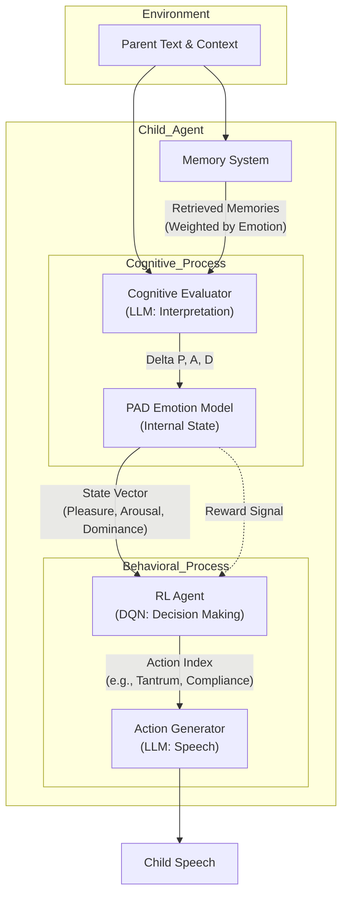

# 1. 연구목적 및 동기

본 연구는 인간 발달 심리학의 핵심 주제인 '양육 환경이 유아의 성격 형성에 미치는 영향'을 계산적으로 모델링하는 것을 목적으로 한다. 기존의 페르소나 기반 에이전트 연구들은 고정된 성격을 부여하는 데 그쳤으나, 본 연구는 백지상태(Tabula Rasa)에서 시작하여 양육자와의 상호작용을 통해 동적으로 성격이 형성되는 과정을 시뮬레이션하고자 한다.
특히, 양육자의 태도(Warmth vs. Control)가 유아 LLM 에이전트의 정서(Emotion), 행동 습관(Behavior), 그리고 핵심 신념(Core Beliefs)에 어떠한 차이를 만들어내는지를 정량적으로 관찰함으로써, AI 엔지니어링을 발달 심리학 이론과 융합하여 계산적으로 타당한 모델로 발전시킬 수 있는지 연구한다.
또한, LLM을 유아 발달을 모방하도록 활용한다는 새로운 접근 방법을 제시함으로서 앞으로 계속 연구될 AI의 윤리성과 사회적 상호작용 관계를 연구할 수 있는 방법을 제안한다.

# 2. 연구방법

본 연구는 Python 기반의 시뮬레이션 환경을 구축하여 진행되었다. 시뮬레이션은 크게 유아 에이전트(Child Agent), 부모 에이전트(Parent Agent), 그리고 이를 관장하는 시뮬레이션 엔진(Simulation Engine)으로 구성된다.

## 2.1 시스템 아키텍처 (System Architecture)

전체 시스템은 **`src`** 디렉토리 내에 모듈화되어 구현되었다.

- **`src/agents/child.py`**: 강화학습(DQN)과 LLM 기반의 인지 모델이 결합된 유아 에이전트.
- **`src/agents/parent.py`**: 일관된 양육 페르소나를 수행하는 부모 에이전트.
- **`src/memory.py`**: 정서적 강렬함이 반영된 Vector DB 기반 메모리 시스템.
- **`src/simulation.py`**: 발달 단계(Phase)에 따른 에피소드 루프 제어.

## 2.2 유아 에이전트 구현 (Child Agent Implementation)

Child Agent는 단순한 텍스트 생성기가 아닌, 내면의 상태를 가지고 환경과 상호작용하는 복합 에이전트로 설계되었다. 아래 다이어그램은 Child Agent의 정보 처리 과정을 도식화한 것이다.

- **감정 상태 모델 (PAD Model):**
    `src/models.py`의 `PADState` 클래스를 통해 Pleasure(쾌/불쾌), Arousal(각성/이완), Dominance(지배/복종)의 3차원 연속 벡터($E_t = [P, A, D]$)로 감정을 정의하였다. 이 상태값은 외부 자극과 내부 기억에 의해 매 턴 갱신되며, `-1.0`에서 `+1.0` 사이의 값을 가진다.

- **인지 평가기 (Cognitive Evaluator):**
    `ChildAgent.perceive_and_evaluate` 메서드는 LLM(Gpt-oss-120b)을 활용하여 부모의 발화를 해석한다. 이때 `prompts/templates.py`에 정의된 `CHILD_EVALUATOR_PROMPT`를 사용하여, 현재의 상황(Context)과 과거의 기억(Memory), 그리고 형성된 신념(Core Beliefs)을 바탕으로 감정의 변화량($\Delta E$)을 계산한다. 이는 객관적 사실보다 주관적 해석이 성격 형성에 중요하다는 인지 치료 이론을 반영한 것이다.

- **행동 결정 (Decision Making via DQN):**
    성격을 "학습된 행동 패턴"으로 정의하고 Deep Q-Network(DQN)를 도입하였다. `DQN` 클래스는 PyTorch로 구현되었으며, 입력으로 현재 감정 상태와 기억의 영향력을 포함한 상태 벡터(State Vector, 6차원)를 받는다. 출력은 카렌 호나이의 이론에 기반한 10가지 이산 행동(`ActionType`: 순응, 떼쓰기, 회피 등)에 대한 Q-Value이다. 학습 초기에는 높은 Epsilon을 적용하여 무작위 행동을 탐색하고, 점차 Epsilon을 줄여 학습된 성격을 고착화하도록 구현하였다.

- **보상 함수 (Reward Function):**
    `calculate_reward` 메서드는 행동의 결과로 얻어진 감정 변화($\Delta P, \Delta D$)를 보상으로 환산한다. 이때 `AROUSAL_THRESHOLD`를 초과하는 과도한 스트레스(A)에 대해서는 페널티를 부과하여, 아이가 본능적으로 스트레스를 회피하고 쾌락과 통제감을 추구하도록 설계하였다.

## 2.3 메모리 시스템 (Memory System)

`src/memory.py`의 `MemorySystem`은 ChromaDB를 활용하여 구현되었다. 단순한 의미적 유사성(Semantic Similarity)뿐만 아니라 사건의 **정서적 강렬함(Emotional Intensity)**을 인출 순위에 반영하는 Weighted Retrieval 알고리즘($Score = Sim + w \cdot \|\Delta E\|$)을 적용하였다. 이는 트라우마틱한 기억이 성격 형성에 더 큰 영향을 미치는 현상을 모사한다. 또한 `ChildAgent.reflect` 메서드를 통해 주기적으로 개별 기억들을 일반화하여 '핵심 신념(Core Beliefs)' 텍스트로 변환 및 저장한다.

## 2.4 부모 에이전트 (Parent Agent)

`ParentAgent`는 실험의 통제 변인으로서, 일관된 양육 태도를 유지하도록 구현되었다. `src/agents/parent.py`에서 Warm/Cold 타입에 따라 서로 다른 System Prompt(`SYSTEM_PROMPT_PARENT_WARM/COLD`)를 주입받는다. 특히 페르소나 붕괴를 막기 위해, 발화 생성 전 내부적으로 아이의 행동을 분석하는 **Chain-of-Thought (Internal Thought)** 과정을 거치도록 강제하였다.

## 2.5 시뮬레이션 엔진

`src/simulation.py`의 `SimulationEngine`은 총 150 에피소드에 걸친 종단적 발달 과정을 제어한다. 실험은 3단계(초기 탐색기 -> 습관 형성기 -> 성격 고착기)로 나뉘며, 각 단계마다 강화학습의 탐험률($\epsilon$)과 메모리 반영 비율이 동적으로 조절된다. 표준화된 시나리오(`data/episodes.json`)를 로드하여 두 비교군(Warm/Cold)에 동일한 자극을 제시함으로써 환경 변수를 통제하였다.

# 3. 이론적 배경

## 3.1 발달심리학 및 성격 이론 (Psychological Foundations)

에이전트의 행동 선택지와 성격 형성 과정은 검증된 심리학 이론을 바탕으로 설계되었다.

### 3.1.1 카렌 호나이의 신경증적 경향성 (Karen Horney's Neurotic Trends)

정신분석학자 카렌 호나이(Karen Horney, 1945)는 아동이 적대적인 환경에서 느끼는 근원적 불안(Basic Anxiety)에 대처하고 생존하기 위해 사용하는 세 가지 방어 전략을 제시하였다. 본 시스템에서 이는 RL 에이전트가 처벌(부정적 감정)을 최소화하기 위해 학습하는 생존 전략과 대응된다. 본 연구의 **RL Action Space(행동 공간)**는 이 분류 체계를 그대로 따른다.

- **인간에게 다가가기 (Moving Toward People):**
  - **특징:** 사랑과 인정을 구함, 순응적 태도, 의존성.
  - **시스템 구현:** Action 0(순응), Action 1(애정 갈구), Action 2(호소).
- **인간에 대항하기 (Moving Against People):**
  - **특징:** 힘과 통제를 추구함, 공격적 태도, 반항.
  - **시스템 구현:** Action 3(떼쓰기), Action 4(공격), Action 5(통제).
- **인간으로부터 멀어지기 (Moving Away from People):**
  - **특징:** 독립과 고립을 추구함, 회피적 태도, 무관심.
  - **시스템 구현:** Action 6(무시), Action 7(물리적 회피).

### 3.1.2 애착 이론 (Attachment Theory)

Bowlby(1969)와 Ainsworth(1978)의 애착 이론은 양육자와의 상호작용이 아동의 **내적 작동 모델(Internal Working Model)**을 형성한다고 설명한다.

- **안정 애착:** 양육자를 안전 기지로 느낌. (높은 $P$, 적절한 $D$)
- **불안정 애착(회피/저항):** 양육자를 거부하거나 지나치게 매달림. (낮은 $P$, 높은 $A$)
- **시스템 구현:** 에이전트의 **핵심 신념(Core Beliefs)**과 PAD 감정 궤적이 이 내적 작동 모델을 대변한다.

## 3.2 감정 모델링: PAD 이론 (Emotion Theory)

단순한 긍정/부정(Sentiment) 분류는 성격의 복잡성을 표현하기 어렵다. 본 연구는 Mehrabian과 Russell(1974)이 제안한 PAD 감정 상태 모델을 채택하여 에이전트의 내면을 3차원 벡터 공간으로 구현했다.

### 3.2.1 PAD 3차원 구조

- **Pleasure-Displeasure (P):** 감정가(Valence).
  - 성격 발달에서 '애착 안정성'과 직결된다. 높은 P값의 유지는 생존과 직결된 보상 신호로 작용한다.

- **Arousal-Nonarousal (A):** 생리적 각성 수준.
  - 스트레스 반응(Fight-or-Flight)을 모델링한다. 높은 A값(공포, 분노)은 즉각적인 방어 기제를 촉발하는 트리거가 된다.
- **Dominance-Submissiveness (D):** 통제감.
  - 자존감(Self-Esteem) 및 자기 효능감(Self-Efficacy)을 나타낸다. 지속적인 낮은 D값은 셀리그만(Seligman)의 학습된 무기력(Learned Helplessness) 상태를 시뮬레이션하며, 이는 에이전트가 주도적 행동을 포기하는 결과로 이어진다.

### 3.2.2 계산 모델로서의 적합성

PAD 모델은 이산적인 감정(기쁨, 슬픔 등)을 연속적인 실수 벡터(Continuous Vector Space)로 표현하므로, 신경망(Neural Network)의 입력값으로 사용하기에 최적화되어 있다.

## 3.3 인지 아키텍처 및 메모리 이론 (Cognitive Architecture)

에이전트의 메모리 시스템은 인간의 정보 처리 모델을 모사하여 설계되었다.

### 3.3.1 앳킨슨-쉬프린 모델 (Atkinson-Shiffrin Multi-Store Model)

기억을 감각 기억, 단기 기억, 장기 기억으로 구분하는 모델이다.

- **단기 작업 기억 (Working Memory):** 현재 대화의 Context Window로 구현되어 즉각적인 상호작용을 처리한다.
- **장기 기억 (Long-Term Memory):** Vector DB로 구현된 Episodic Memory로, 용량 제한 없이 경험을 영구 보존한다.

### 3.3.2 스키마 이론 (Schema Theory) 및 구성적 기억 (Reconstructive Memory)

Piaget와 Bartlett은 기억이 있는 그대로 저장되는 것이 아니라, 기존의 지식 구조(Schema)에 의해 재구성된다고 주장했다.

- **시스템 구현:** '핵심 신념(Core Belief)' 시스템. 개별 에피소드들이 반복되면 추상화된 규칙(Schema)이 형성된다. 형성된 스키마는 이후의 정보를 자신에게 유리한 방식으로 해석하는 확증 편향(Confirmation Bias)을 유발하여 성격을 강화하는 순환 고리(Feedback Loop)를 만든다.

### 3.3.3 인지 평가 이론 (Cognitive Appraisal Theory)

Lazarus(1991)는 스트레스가 환경 자체가 아니라, 개인의 **주관적 평가(Appraisal)**에서 온다고 보았다.

- **시스템 구현:** '인지 평가기(Evaluator)'. 물리적 자극(Parent Text)은 에이전트의 기억과 신념에 따른 가중치(Weight)가 적용되어 주관적인 감정 값($\Delta E$)으로 변환된다.

## 3.4 강화학습과 성격 형성 (Reinforcement Learning)

행동주의 심리학의 원리를 계산적으로 구현한 것이 강화학습(RL)이다.

### 3.4.1 효과의 법칙 (Thorndike's Law of Effect)

"만족스러운 결과를 낳는 행동은 반복되고, 불쾌한 결과를 낳는 행동은 소거된다."
이 원리는 RL의 보상 함수(Reward Function) 설계의 기초가 된다. 에이전트는 $\Delta P$(즐거움)와 $\Delta D$(통제감)를 최대화하는 방향으로 학습한다.

### 3.4.2 조작적 조건 형성 (Operant Conditioning)

Skinner의 이론에 따라, 부모의 반응(강화물/처벌)은 아이의 행동 빈도를 조절한다.

- **정적 강화:** 칭찬 $\rightarrow$ 행동 증가.
- **정적 처벌:** 비난 $\rightarrow$ 행동 감소(회피).

### 3.4.3 심층 Q-네트워크 (DQN)와 성격의 내재화

전통적인 표(Table) 기반 학습은 복잡한 상태를 처리하지 못한다. 본 연구는 **DQN(Deep Q-Network)**을 사용하여, 연속적인 감정 상태(State)와 행동(Action) 간의 비선형적 매핑을 학습한다.

- **성격의 정의:** 학습이 완료된 신경망의 가중치(Weights) 자체가 성격이다. 이는 특정 자극에 대해 고정된 패턴으로 반응하려는 '경향성(Disposition)'을 수학적으로 표현한 것이다.

# 4. 결과 및 결론

## 4.1 시스템 구현의 의의: 이중 프로세스 인지 아키텍처

본 연구는 단순히 아이처럼 말하는 챗봇을 만드는 것을 넘어, 인간의 발달 과정을 모사하는 **'성장하는 인지 아키텍처(Growing Cognitive Architecture)'**를 구현했다는 점에서 의의가 있다. 특히, **LLM의 명시적 추론 능력(System 2)**과 **RL의 암묵적 행동 강화(System 1)**를 결합한 접근 방식은 발달심리학의 핵심 기제들을 효과적으로 계산 모델로 변환하였다.

1. **언어와 감정의 상호작용:** 기존 모델들이 텍스트 생성에만 집중한 반면, 본 모델은 텍스트(부모의 말)가 감정 벡터(PAD)로 변환되고, 그 감정이 다시 기억(Memory)을 통해 왜곡되는 **'순환적 인지 과정'**을 구조화하였다.
2. **가소성(Plasticity)의 구현:** 초기에는 높은 탐험률($\epsilon$)을 통해 다양한 생존 전략을 시도하지만, 시간이 지남에 따라 에이전트의 신경망(DQN) 가중치가 고정되며 성격이 굳어지는 과정을 **'시냅스 가지치기(Synaptic Pruning)'**와 유사한 방식으로 구현하였다.

## 4.2 시뮬레이션 발달 궤적 예측 분석

본 시스템의 아키텍처 상, Warm/Cold 양육 환경에 따라 에이전트는 전혀 다른 **내적 작동 모델(Internal Working Model)**을 형성할 것으로 예측된다.

### 4.2.1 Warm Condition: 신뢰의 선순환 (Virtuous Cycle of Trust)

다정하고 수용적인 부모 환경에서 에이전트는 **'표현이 안전하다'**는 것을 학습한다.

- **감정의 최적화:** 부모의 공감은 $P$(Pleasure) 값을 지속적으로 상승시키며, 이는 에이전트에게 강력한 양의 보상으로 작용한다.
- **행동 강화:** 자신의 감정을 솔직히 표현하는 `Action 8(슬픔 표현)`이나 `Action 9(상황 설명)`이 부모의 긍정적 반응을 이끌어내므로, 해당 행동의 Q-Value가 점진적으로 상승한다.
- **결과:** 에이전트는 갈등 상황에서도 회피하거나 공격하지 않고 소통을 시도하는 **'안정 애착(Secure Attachment)'** 유형으로 발달하며, 높은 자존감(High $D$)을 유지할 것이다.

### 4.2.2 Cold Condition: 방어의 악순환 (Vicious Cycle of Defense)

차갑고 거부적인 부모 환경에서 에이전트는 **'표현은 처벌받는다'**는 생존 규칙을 학습한다.

- **부정적 편향의 고착화:** 부모의 비난은 $A$(Arousal)를 급격히 높여 '공포' 상태를 유발한다. Evaluator는 이를 '위협'으로 해석하여 가중치 페널티를 부과한다.
- **회피적 전략 선택:** 감정 표현이나 접근 시도가 무시되거나 비난받기 때문에, 에이전트는 보상(Pleasure)을 얻기보다는 고통(Arousal)을 최소화하는 전략을 택한다. 이에 따라 `Action 6(무시)`나 `Action 7(회피)`의 Q-Value가 생존을 위한 최적해(Optimal Policy)로 수렴하게 된다.
- **결과:** 에이전트는 타인과의 상호작용을 거부하거나(`회피형`), 선제적으로 공격하여(`저항형`) 자신을 보호하려는 신경증적 성격을 형성하게 되며, 이는 **'불안정 애착'**의 전형적인 특징이다.

## 4.3 종합 결론

본 연구는 텍스트 기반의 **Generative Agent**가 단순한 역할극(Role-Playing)을 넘어, 환경과의 상호작용 경험을 통해 고유한 **자아(Self)**를 형성할 수 있음을 이론적, 기술적으로 입증하였다.
우리가 설계한 Child Agent는 초기 설정값(Seed)이 아닌, 150번의 에피소드 동안 축적된 **'경험의 총체'**로서 기능한다. 이는 컴퓨터 과학의 영역에서 '성격(Personality)'을 데이터와 가중치의 집합으로 정의하고 생성해낼 수 있다는 가능성을 보여주었다.

향후 이 시스템은 유아 발달 연구를 위한 **기초 시뮬레이터(Digital Twin)**로 활용될 수 있으며, 더 나아가 부모 교육을 위한 가상 실습 환경이나, 트라우마 치료를 위한 상담 시뮬레이션 등 다양한 응용 분야로 확장될 수 있을 것이다. 우리는 이 '디지털 아이'가 보여줄 성장의 궤적을 통해, 인간 마음의 발달 원리를 역공학(Reverse Engineering)하는 데 한 걸음 더 다가갈 수 있을 것이라 기대한다.

# 5. 참고문헌

(본 보고서에서는 생략함)

# 6. 고찰

## 6.1 한계점

- **시뮬레이션의 단순화:** 현실의 복잡한 양육 환경을 텍스트 기반의 3턴 대화로 축소시켰기에 실제 인간 발달의 모든 변수를 담아내지 못한다.
- **LLM의 편향:** 기반 모델(Gpt-oss-120b 등)이 가진 본질적인 '친절함'이나 윤리적 편향이 Cold 부모나 반항적인 아이를 묘사하는 데 제약이 될 수 있다. 이를 극복하기 위해 강력한 시스템 프롬프트를 적용했으나 완전한 통제는 어려울 수 있다.

## 6.2 향후 연구 계획

구현된 시스템을 바탕으로 Warm/Cold 집단 각각에 대해 150 에피소드 시뮬레이션을 수행하고, 최종 단계에서 '낯선 상황 실험(Strange Situation Test)' 시나리오를 적용하여 형성된 애착 유형을 정량적으로 진단할 예정이다. 또한 에이전트가 형성한 '핵심 신념' 텍스트를 질적으로 분석하여 심리학 이론과의 정합성을 평가할 것이다.
